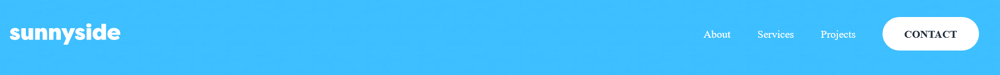

# Frontend Mentor - sunnyside agency landing page solution

A Personal project.

This is a solution to the [Loopstudios landing page challenge on Frontend Mentor](https://www.frontendmentor.io/challenges/sunnyside-agency-landing-page-7yVs3B6ef/hub/sunnyside-agency-landing-page-ESM-9dMZl). Frontend Mentor challenges help you improve your coding skills by building realistic projects.

## Table of contents

- [Overview](#overview)
  - [The challenge](#the-challenge)
  - [Screenshots](#screenshots)
  - [Links](#links)
- [My process](#my-process)
  - [Built with](#built-with)
  - [What we learned](#what-we-learned)
  - [Continued development](#continued-development)
  - [Useful resources](#useful-resources)
- [Authors](#authors)
- [Acknowledgments](#acknowledgments)

## Overview

### The challenge

Users should be able to:

- View the optimal layout for the site depending on their device's screen size


### Screenshots




Screenshot of the _Header_ and _Footer_ sections 


Screenshot of the _Hero_ and _Gallery_ sections 


Screenshot of the general overview of the site in mobile view.

### Links

- Solution URL: [Challenge Solution](https://www.frontendmentor.io/challenges/loopstudios-landing-page-N88J5Onjw/hub/loopstudios-landing-page-ACvA48Gj4)
- Live Site URL: [Loopstudios](https://iraytee-code.github.io/loopstudios-landing-page-main/)

## My process

- I set up the base project by _creating the GitHub repository_, _setting up global styling_, _including the required assets_, and so on. I then proceeded to code the _header_ and _footer_ sections of the project and after I was done, then i worked on the _Hero_ and _Gallery_ sections.

  During the entire project life cycle i followed courses online to get  thoughts and ideas on how to make the project meet web standards and kept track of our overall progress.

### Built with

- Semantic HTML5 markup
- CSS Flexbox
- Desktop-first workflow
- [Inkscape](https://inkscape.org) - Inkscape: Open Source Scalable Vector Graphics Editor

### What We learned

-  Before this project, I had no idea that you could set mutliple images to show for different screen sizes using the `<picture>` element.

```html
<picture>
        <source media="(min-width: 768px)" srcset="./images/mobile/image-stand-out.jpg">
        <source media="(max-width: 768px)" srcset="./images/mobile/image-stand-out.jpg">
        
</picture>
```

### Continued development

-  I want to apply the features and best practices that I've learnt from working on this project to future projects.

### Useful resources

## Authors

- GitHub - [Adeniran Hope](https://github.com/iraytee-code)


## Acknowledgments

- personally being a self taught developer has made me quest for more in my journey and frontend mentors has provided the platform for me to challenge myself to be better everyday. 
[Back to top](#frontend-mentor---sunnyside-agency-landing-page-main)